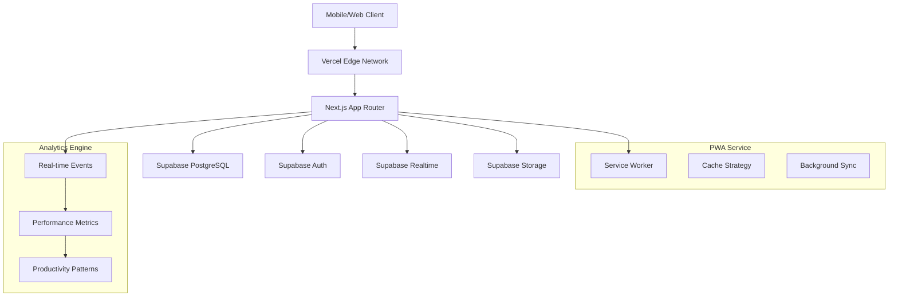
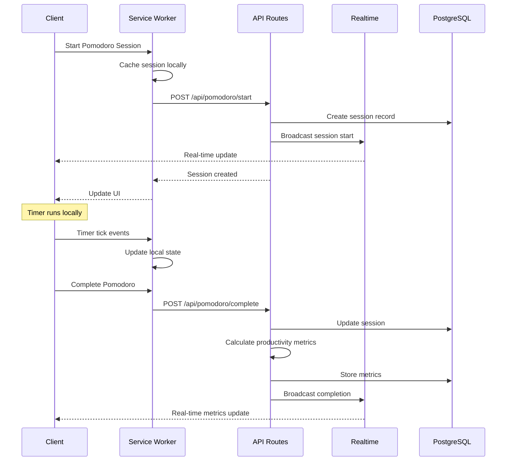

# TaskFlow Pro - Technical Design Document

## 🏗️ **Technical Architecture Overview**

### System Context
TaskFlow Pro es una aplicación web progresiva (PWA) de gestión de tareas con técnica Pomodoro integrada, backend serverless, analytics en tiempo real y capacidades offline.

### Architecture Goals
- **Performance:** <1s page load time, <100ms timer precision
- **Scalability:** Serverless architecture con auto-scaling global
- **Real-time:** Sincronización <200ms entre dispositivos
- **Offline First:** PWA funcional sin conexión a internet
- **Focus UX:** Diseño optimizado para productividad y bienestar mental

---

## 🏛️ **System Architecture**

### High-Level Architecture


### Technology Stack ✅ **VALIDADO**

#### Frontend
- **Framework:** Next.js 14 (App Router + Server Components)
- **Language:** TypeScript con modo estricto
- **Styling:** Tailwind CSS + focus-friendly color system
- **State Management:** React Query + Zustand para estado global
- **PWA:** Next PWA + Service Workers personalizados
- **UI Components:** Headless UI + Component library custom
- **Animation:** Framer Motion para micro-interacciones suaves

#### Backend
- **Runtime:** Node.js Edge Runtime (Vercel Functions)
- **Framework:** Next.js API Routes + Server Actions
- **API Style:** RESTful + WebSocket para real-time features
- **Validation:** Zod schemas con TypeScript integration
- **Background Jobs:** Vercel Cron para analytics batch processing

#### Database & Storage
- **Primary:** PostgreSQL (Supabase) con pgVector extension
- **Real-time:** Supabase Realtime subscriptions
- **Cache:** Redis (Supabase) para session management
- **File Storage:** Supabase Storage para analytics exports
- **Search:** Full-text search con Supabase FTS

#### Infrastructure
- **Cloud Provider:** Vercel (Frontend + Functions + Edge)
- **Database:** Supabase (PostgreSQL + Auth + Realtime + Storage)
- **CDN:** Vercel Edge Network global
- **Monitoring:** Vercel Analytics + Custom dashboard
- **Error Tracking:** Sentry integrado

---

## 📊 **Data Architecture**

### Data Models

#### Core Entities
```typescript
// User
interface User {
  id: string;
  email: string;
  name: string;
  avatar?: string;
  timezone: string;
  preferences: UserPreferences;
  createdAt: Date;
  updatedAt: Date;
}

interface UserPreferences {
  pomodoroLength: 25; // minutes
  shortBreakLength: 5; // minutes
  longBreakLength: 15; // minutes
  autoStartBreaks: boolean;
  autoStartPomodoros: boolean;
  desktopNotifications: boolean;
  soundAlerts: boolean;
  theme: 'light' | 'dark' | 'auto';
  workingHours: {
    start: string; // "09:00"
    end: string;   // "17:00"
  };
}

// Task
interface Task {
  id: string;
  userId: string;
  title: string;
  description?: string;
  dueDate?: Date;
  priority: 'low' | 'medium' | 'high' | 'urgent';
  category: 'work' | 'personal' | 'study' | 'health';
  estimatedPomodoros: number;
  actualPomodoros: number;
  completed: boolean;
  completedAt?: Date;
  createdAt: Date;
  updatedAt: Date;
  tags: string[];
}

// Pomodoro Session
interface PomodoroSession {
  id: string;
  userId: string;
  taskId?: string;
  type: 'pomodoro' | 'short_break' | 'long_break';
  startTime: Date;
  endTime?: Date;
  duration: number; // minutes
  completed: boolean;
  interruptions: number;
  notes?: string;
  createdAt: Date;
}

// Productivity Analytics
interface ProductivityMetrics {
  id: string;
  userId: string;
  date: Date;
  totalPomodoros: number;
  completedTasks: number;
  focusTime: number; // minutes
  interruptions: number;
  productivityScore: number; // 0-100
  peakHours: number[];
  createdAt: Date;
  updatedAt: Date;
}
```

### Database Schema
```sql
-- Users table (managed by Supabase Auth + custom fields)
CREATE TABLE users (
  id UUID PRIMARY KEY,
  email VARCHAR(255) UNIQUE NOT NULL,
  name VARCHAR(255),
  avatar TEXT,
  timezone VARCHAR(50) DEFAULT 'UTC',
  preferences JSONB DEFAULT '{}',
  created_at TIMESTAMP DEFAULT NOW(),
  updated_at TIMESTAMP DEFAULT NOW()
);

-- Tasks table
CREATE TABLE tasks (
  id UUID PRIMARY KEY DEFAULT gen_random_uuid(),
  user_id UUID NOT NULL REFERENCES users(id) ON DELETE CASCADE,
  title VARCHAR(255) NOT NULL,
  description TEXT,
  due_date TIMESTAMP WITH TIME ZONE,
  priority VARCHAR(10) CHECK (priority IN ('low', 'medium', 'high', 'urgent')) DEFAULT 'medium',
  category VARCHAR(20) DEFAULT 'personal',
  estimated_pomodoros INTEGER DEFAULT 1,
  actual_pomodoros INTEGER DEFAULT 0,
  completed BOOLEAN DEFAULT FALSE,
  completed_at TIMESTAMP WITH TIME ZONE,
  created_at TIMESTAMP DEFAULT NOW(),
  updated_at TIMESTAMP DEFAULT NOW(),
  tags TEXT[] DEFAULT '{}'
);

-- Pomodoro Sessions table
CREATE TABLE pomodoro_sessions (
  id UUID PRIMARY KEY DEFAULT gen_random_uuid(),
  user_id UUID NOT NULL REFERENCES users(id) ON DELETE CASCADE,
  task_id UUID REFERENCES tasks(id) ON DELETE SET NULL,
  type VARCHAR(20) CHECK (type IN ('pomodoro', 'short_break', 'long_break')) NOT NULL,
  start_time TIMESTAMP WITH TIME ZONE NOT NULL,
  end_time TIMESTAMP WITH TIME ZONE,
  duration INTEGER NOT NULL, -- minutes
  completed BOOLEAN DEFAULT FALSE,
  interruptions INTEGER DEFAULT 0,
  notes TEXT,
  created_at TIMESTAMP DEFAULT NOW()
);

-- Productivity Metrics table
CREATE TABLE productivity_metrics (
  id UUID PRIMARY KEY DEFAULT gen_random_uuid(),
  user_id UUID NOT NULL REFERENCES users(id) ON DELETE CASCADE,
  date DATE NOT NULL,
  total_pomodoros INTEGER DEFAULT 0,
  completed_tasks INTEGER DEFAULT 0,
  focus_time INTEGER DEFAULT 0, -- minutes
  interruptions INTEGER DEFAULT 0,
  productivity_score INTEGER CHECK (productivity_score >= 0 AND productivity_score <= 100),
  peak_hours INTEGER[] DEFAULT '{}',
  created_at TIMESTAMP DEFAULT NOW(),
  updated_at TIMESTAMP DEFAULT NOW(),
  
  UNIQUE(user_id, date)
);

-- Vector embeddings for task similarity (pgVector)
CREATE EXTENSION IF NOT EXISTS vector;
ALTER TABLE tasks ADD COLUMN embedding vector(384);

-- Indexes for performance
CREATE INDEX idx_tasks_user_id ON tasks(user_id);
CREATE INDEX idx_tasks_due_date ON tasks(due_date) WHERE due_date IS NOT NULL;
CREATE INDEX idx_tasks_category ON tasks(category);
CREATE INDEX idx_tasks_completed ON tasks(completed);
CREATE INDEX idx_tasks_created_at ON tasks(created_at);

CREATE INDEX idx_pomodoro_user_session ON pomodoro_sessions(user_id, start_time);
CREATE INDEX idx_pomodoro_task_id ON pomodoro_sessions(task_id) WHERE task_id IS NOT NULL;

CREATE INDEX idx_productivity_date ON productivity_metrics(user_id, date);

-- Vector index for semantic search
CREATE INDEX idx_tasks_embedding ON tasks USING ivfflat (embedding vector_cosine_ops);
```

### Data Flow Patterns


---

## 🔌 **API Design**

### API Endpoints

#### Authentication (Supabase Managed)
```typescript
// OAuth providers: Google, GitHub, Microsoft
interface AuthConfig {
  providers: ['google', 'github', 'microsoft'];
  redirectTo: string;
  queryParams: Record<string, string>;
}

// Enhanced user profile
interface UserProfile {
  id: string;
  email: string;
  name: string;
  avatar?: string;
  preferences: UserPreferences;
  subscription: 'free' | 'pro' | 'teams';
}
```

#### Tasks API
```typescript
// GET /api/tasks
interface TasksQuery {
  category?: 'work' | 'personal' | 'study' | 'health';
  priority?: 'low' | 'medium' | 'high' | 'urgent';
  completed?: boolean;
  dueDate?: string; // ISO date
  search?: string;
  limit?: number;
  offset?: number;
}

interface TasksResponse {
  data: Task[];
  pagination: {
    total: number;
    limit: number;
    offset: number;
    hasMore: boolean;
  };
  filters: {
    categories: CategoryCount[];
    priorities: PriorityCount[];
  };
}

// POST /api/tasks
interface CreateTaskRequest {
  title: string;
  description?: string;
  dueDate?: string;
  priority?: 'low' | 'medium' | 'high' | 'urgent';
  category?: 'work' | 'personal' | 'study' | 'health';
  estimatedPomodoros?: number;
  tags?: string[];
}

// PUT /api/tasks/:id/suggest-pomodoros
interface SuggestPomodorosResponse {
  suggestedPomodoros: number;
  reasoning: string;
  similarTasks: {
    title: string;
    actualPomodoros: number;
  }[];
}
```

#### Pomodoro API
```typescript
// POST /api/pomodoro/start
interface StartPomodoroRequest {
  taskId?: string;
  type: 'pomodoro' | 'short_break' | 'long_break';
  customDuration?: number; // minutes
}

interface PomodoroSession {
  id: string;
  startTime: string;
  endTime?: string;
  duration: number;
  type: string;
  taskId?: string;
  status: 'active' | 'paused' | 'completed' | 'abandoned';
}

// GET /api/pomodoro/active
interface ActiveSessionResponse {
  session: PomodoroSession | null;
  timeRemaining: number; // seconds
  canStartBreak: boolean;
}

// POST /api/pomodoro/complete
interface CompleteSessionRequest {
  sessionId: string;
  interruptions: number;
  notes?: string;
  actualDuration: number; // seconds
}

// WebSocket: /api/pomodoro/live
interface PomodoroWebSocketEvents {
  'session:started': { session: PomodoroSession };
  'session:updated': { sessionId: string; timeRemaining: number };
  'session:completed': { session: PomodoroSession; metrics: ProductivityUpdate };
  'break:suggested': { breakType: string; duration: number };
}
```

#### Analytics API
```typescript
// GET /api/analytics/dashboard
interface DashboardResponse {
  today: {
    completedTasks: number;
    totalPomodoros: number;
    focusTime: number;
    productivityScore: number;
  };
  week: {
    dailyStats: DailyStats[];
    totalFocusTime: number;
    topCategories: CategoryStats[];
  };
  patterns: {
    peakProductivityHours: number[];
    averageSessionLength: number;
    completionRate: number;
  };
}

// GET /api/analytics/productivity
interface ProductivityQuery {
  startDate: string;
  endDate: string;
  granularity: 'day' | 'week' | 'month';
}

interface ProductivityResponse {
  data: ProductivityMetrics[];
  insights: {
    mostProductiveDay: string;
    averageFocusTime: number;
    taskCompletionRate: number;
    improvementSuggestions: string[];
  };
}

// POST /api/analytics/export
interface ExportRequest {
  format: 'csv' | 'json' | 'pdf';
  dateRange: {
    startDate: string;
    endDate: string;
  };
  includeTasks: boolean;
  includeSessions: boolean;
  includeMetrics: boolean;
}
```

### Authentication & Security
```typescript
// Enhanced authentication middleware
const requireAuth = (handler: Function) => async (req: Request) => {
  try {
    const authHeader = req.headers.get('authorization');
    if (!authHeader?.startsWith('Bearer ')) {
      throw new Error('No authorization token');
    }
    
    const token = authHeader.replace('Bearer ', '');
    const { data: { user }, error } = await supabase.auth.getUser(token);
    
    if (error || !user) {
      throw new Error('Invalid token');
    }
    
    // Check subscription status for premium features
    const subscription = await getUserSubscription(user.id);
    req.user = { ...user, subscription };
    
    return handler(req);
  } catch (error) {
    return NextResponse.json(
      { error: 'Unauthorized' },
      { status: 401 }
    );
  }
};

// Rate limiting
const rateLimit = require('express-rate-limit');

const apiLimiter = rateLimit({
  windowMs: 15 * 60 * 1000, // 15 minutes
  max: 100, // limit each IP to 100 requests per windowMs
  message: 'Too many requests from this IP'
});
```

---

## 🚀 **Component Architecture**

### Frontend Components
```typescript
// app/components/PomodoroTimer.tsx
interface PomodoroTimerProps {
  task?: Task;
  onSessionStart: (session: PomodoroSession) => void;
  onSessionComplete: (data: CompleteSessionRequest) => void;
  settings: PomodoroSettings;
}

const PomodoroTimer: React.FC<PomodoroTimerProps> = ({
  task,
  onSessionStart,
  onSessionComplete,
  settings
}) => {
  const [session, setSession] = useState<PomodoroSession | null>(null);
  const [timeRemaining, setTimeRemaining] = useState<number>(0);
  
  // WebSocket connection for real-time updates
  useWebSocket('/api/pomodoro/live', {
    onMessage: (event) => {
      const data = JSON.parse(event.data);
      switch (data.type) {
        case 'session:updated':
          setTimeRemaining(data.timeRemaining);
          break;
        case 'session:completed':
          setSession(null);
          break;
      }
    }
  });
  
  // Service Worker integration for offline functionality
  useEffect(() => {
    if ('serviceWorker' in navigator) {
      navigator.serviceWorker.addEventListener('message', (event) => {
        if (event.data.type === 'pomodoro:tick') {
          setTimeRemaining(event.data.timeRemaining);
        }
      });
    }
  }, []);
  
  return (
    <div className="focus-friendly-timer">
      <TimerDisplay 
        timeRemaining={timeRemaining}
        sessionType={session?.type}
      />
      <TimerControls 
        session={session}
        onStart={() => startSession()}
        onPause={() => pauseSession()}
        onComplete={() => completeSession()}
      />
      {task && (
        <TaskContext task={task} />
      )}
    </div>
  );
};

// app/components/TaskBoard.tsx
interface TaskBoardProps {
  filter: TaskFilter;
  onTaskSelect: (task: Task) => void;
}

// app/components/AnalyticsDashboard.tsx
interface AnalyticsDashboardProps {
  dateRange: DateRange;
  onExport: (format: string) => void;
}

// app/components/ProductivityInsights.tsx
interface ProductivityInsightsProps {
  metrics: ProductivityMetrics[];
  patterns: ProductivityPatterns;
}
```

### PWA Service Worker
```typescript
// public/sw.js
const CACHE_NAME = 'taskflow-pro-v1';
const OFFLINE_URL = '/offline';

// Cache strategy: networkFirst for API, cacheFirst for assets
const registerRoute = (self: ServiceWorkerGlobalScope) => {
  self.addEventListener('fetch', (event) => {
    const { request } = event;
    
    // API requests - Network First
    if (request.url.includes('/api/')) {
      event.respondWith(networkFirst(request));
      return;
    }
    
    // Timer updates - Cache First with background sync
    if (request.url.includes('/api/pomodoro/')) {
      event.respondWith(cacheFirst(request));
      // Register background sync
      event.waitUntil(
        self.registration.sync.register('pomodoro-sync')
      );
      return;
    }
    
    // Static assets - Cache First
    event.respondWith(cacheFirst(request));
  });
};

// Background sync for offline Pomodoro sessions
self.addEventListener('sync', (event) => {
  if (event.tag === 'pomodoro-sync') {
    event.waitUntil(syncPomodoroSessions());
  }
});

// Push notifications for break reminders
self.addEventListener('push', (event) => {
  const options = {
    body: event.data.text(),
    icon: '/icons/icon-192x192.png',
    badge: '/icons/badge-72x72.png',
    vibrate: [200, 100, 200],
    data: {
      dateOfArrival: Date.now(),
      primaryKey: 1
    },
    actions: [
      {
        action: 'start-break',
        title: 'Start Break',
        icon: '/icons/checkmark.png'
      },
      {
        action: 'skip-break',
        title: 'Skip Break',
        icon: '/icons/xmark.png'
      }
    ]
  };
  
  event.waitUntil(
    self.registration.showNotification('Pomodoro Break Time!', options)
  );
});
```

### Real-time Services
```typescript
// lib/services/realtimeService.ts
export class RealtimeService {
  private supabase: SupabaseClient;
  private subscriptions: Map<string, RealtimeChannel> = new Map();
  
  constructor() {
    this.supabase = createClient();
  }
  
  subscribeToPomodoroSessions(userId: string, callback: (session: PomodoroSession) => void) {
    const channel = this.supabase
      .channel(`pomodoro:${userId}`)
      .on('postgres_changes', 
        { event: '*', schema: 'public', table: 'pomodoro_sessions', filter: `user_id=eq.${userId}` },
        (payload) => callback(payload.new as PomodoroSession)
      )
      .subscribe();
      
    this.subscriptions.set(`pomodoro:${userId}`, channel);
    return channel;
  }
  
  subscribeToTasks(userId: string, callback: (task: Task) => void) {
    const channel = this.supabase
      .channel(`tasks:${userId}`)
      .on('postgres_changes',
        { event: '*', schema: 'public', table: 'tasks', filter: `user_id=eq.${userId}` },
        (payload) => callback(payload.new as Task)
      )
      .subscribe();
      
    this.subscriptions.set(`tasks:${userId}`, channel);
    return channel;
  }
  
  unsubscribe(channelKey: string) {
    const channel = this.subscriptions.get(channelKey);
    if (channel) {
      this.supabase.removeChannel(channel);
      this.subscriptions.delete(channelKey);
    }
  }
}
```

---

## 🔒 **Security Architecture**

### Advanced Security Implementation
```typescript
// Multi-layer input validation
const createTaskSchema = z.object({
  title: z.string()
    .min(1, 'Title is required')
    .max(255, 'Title too long')
    .transform(val => val.trim()),
  description: z.string()
    .max(2000, 'Description too long')
    .transform(val => val?.trim())
    .optional(),
  dueDate: z.string()
    .datetime()
    .refine(date => new Date(date) > new Date(), 'Due date must be in future')
    .optional(),
  priority: z.enum(['low', 'medium', 'high', 'urgent']).optional(),
  category: z.enum(['work', 'personal', 'study', 'health']).optional(),
  estimatedPomodoros: z.number()
    .int()
    .min(1, 'At least 1 Pomodoro required')
    .max(20, 'Maximum 20 Pomodoros per task')
    .optional(),
  tags: z.array(z.string().max(50)).max(10).optional()
});

// CSRF protection
export const csrfProtection = (handler: Function) => async (req: Request) => {
  const origin = req.headers.get('origin');
  const allowedOrigins = process.env.ALLOWED_ORIGINS?.split(',') || [];
  
  if (origin && !allowedOrigins.includes(origin)) {
    return NextResponse.json(
      { error: 'Origin not allowed' },
      { status: 403 }
    );
  }
  
  return handler(req);
};

// Data encryption for sensitive data
export const encryptUserPreferences = (preferences: UserPreferences): string => {
  const key = process.env.ENCRYPTION_KEY;
  return CryptoJS.AES.encrypt(JSON.stringify(preferences), key).toString();
};

export const decryptUserPreferences = (encrypted: string): UserPreferences => {
  const key = process.env.ENCRYPTION_KEY;
  const bytes = CryptoJS.AES.decrypt(encrypted, key);
  return JSON.parse(bytes.toString(CryptoJS.enc.Utf8));
};
```

### Privacy & Compliance
```typescript
// GDPR compliance
interface PrivacySettings {
  dataRetention: number; // days
  analyticsEnabled: boolean;
  shareAnonymousData: boolean;
  exportData: boolean;
  deleteAccount: boolean;
}

// Data anonymization for analytics
export const anonymizeSessionData = (session: PomodoroSession): PomodoroSession => {
  return {
    ...session,
    userId: 'anonymous',
    taskId: session.taskId ? 'anonymous-task' : undefined,
    notes: undefined // Remove sensitive notes
  };
};

// Right to be forgotten
export const deleteUserAccount = async (userId: string): Promise<void> => {
  // Delete all user data
  await Promise.all([
    supabase.from('tasks').delete().eq('user_id', userId),
    supabase.from('pomodoro_sessions').delete().eq('user_id', userId),
    supabase.from('productivity_metrics').delete().eq('user_id', userId),
    supabase.auth.admin.deleteUser(userId)
  ]);
};
```

---

## 📈 **Performance Architecture**

### Advanced Optimization Strategies
```typescript
// Smart caching with React Query
export const useTasks = (filters: TasksQuery) => {
  return useQuery({
    queryKey: ['tasks', filters],
    queryFn: () => fetchTasks(filters),
    staleTime: 1000 * 60 * 5, // 5 minutes
    cacheTime: 1000 * 60 * 30, // 30 minutes
    refetchOnWindowFocus: false,
    refetchOnReconnect: true,
    select: (data) => {
      // Client-side filtering and sorting
      return filterAndSortTasks(data, filters);
    }
  });
};

// Background sync for offline functionality
export const useOfflineSync = () => {
  const queryClient = useQueryClient();
  
  useEffect(() => {
    const handleOnline = () => {
      // Sync offline changes when back online
      syncOfflineChanges().then(() => {
        queryClient.invalidateQueries(['tasks']);
        queryClient.invalidateQueries(['pomodoro']);
      });
    };
    
    window.addEventListener('online', handleOnline);
    return () => window.removeEventListener('online', handleOnline);
  }, [queryClient]);
};

// Performance monitoring
export const usePerformanceMetrics = () => {
  const [metrics, setMetrics] = useState<PerformanceMetrics>({});
  
  useEffect(() => {
    const measurePerformance = () => {
      const navigation = performance.getEntriesByType('navigation')[0] as PerformanceNavigationTiming;
      const paint = performance.getEntriesByType('paint');
      
      setMetrics({
        fcp: paint.find(entry => entry.name === 'first-contentful-paint')?.startTime,
        lcp: paint.find(entry => entry.name === 'largest-contentful-paint')?.startTime,
        loadTime: navigation.loadEventEnd - navigation.fetchStart,
        domInteractive: navigation.domInteractive - navigation.fetchStart
      });
    };
    
    measurePerformance();
    window.addEventListener('load', measurePerformance);
    
    return () => window.removeEventListener('load', measurePerformance);
  }, []);
  
  return metrics;
};
```

### Database Performance
```sql
-- Advanced indexing for complex queries
CREATE INDEX CONCURRENTLY idx_tasks_composite ON tasks(user_id, completed, priority, due_date);
CREATE INDEX CONCURRENTLY idx_pomodoro_composite ON pomodoro_sessions(user_id, start_time DESC, completed);

-- Partitioning for large datasets (future-proofing)
CREATE TABLE pomodoro_sessions_partitioned (
  LIKE pomodoro_sessions INCLUDING ALL
) PARTITION BY RANGE (start_time);

CREATE TABLE pomodoro_sessions_2024 PARTITION OF pomodoro_sessions_partitioned
FOR VALUES FROM ('2024-01-01') TO ('2025-01-01');

-- Materialized view for analytics performance
CREATE MATERIALIZED VIEW daily_productivity AS
SELECT 
  user_id,
  DATE(start_time) as date,
  COUNT(*) FILTER (WHERE type = 'pomodoro' AND completed = true) as completed_pomodoros,
  COUNT(*) FILTER (WHERE type = 'pomodoro') as total_pomodoros,
  SUM(duration) FILTER (WHERE type = 'pomodoro' AND completed = true) as focus_time,
  AVG(duration) FILTER (WHERE type = 'pomodoro' AND completed = true) as avg_session_length
FROM pomodoro_sessions
GROUP BY user_id, DATE(start_time);

-- Refresh strategy for materialized view
CREATE OR REPLACE FUNCTION refresh_daily_productivity()
RETURNS void AS $$
BEGIN
  REFRESH MATERIALIZED VIEW CONCURRENTLY daily_productivity;
END;
$$ LANGUAGE plpgsql;

-- Schedule refresh (requires pg_cron extension)
SELECT cron.schedule('refresh-analytics', '0 2 * * *', 'SELECT refresh_daily_productivity();');
```

---

## 📊 **Monitoring & Observability**

### Comprehensive Error Handling
```typescript
// Error boundaries with context
export class TaskFlowError extends Error {
  constructor(
    message: string,
    public code: string,
    public statusCode: number = 500,
    public context?: Record<string, any>,
    public isOperational: boolean = true
  ) {
    super(message);
    this.name = this.constructor.name;
    
    // Send to Sentry
    if (typeof window !== 'undefined') {
      Sentry.captureException(this, {
        contexts: { custom: context }
      });
    }
  }
}

// Error categorization
export const errorCategories = {
  VALIDATION_ERROR: 'validation_error',
  AUTHENTICATION_ERROR: 'auth_error',
  NETWORK_ERROR: 'network_error',
  TIMER_ERROR: 'timer_error', // Critical for Pomodoro functionality
  SYNC_ERROR: 'sync_error',
  SUBSCRIPTION_ERROR: 'subscription_error'
};

// Retry logic for critical operations
export const retryOperation = async <T>(
  operation: () => Promise<T>,
  maxRetries: number = 3,
  delay: number = 1000
): Promise<T> => {
  for (let attempt = 1; attempt <= maxRetries; attempt++) {
    try {
      return await operation();
    } catch (error) {
      if (attempt === maxRetries) {
        throw error;
      }
      
      // Exponential backoff
      await new Promise(resolve => setTimeout(resolve, delay * Math.pow(2, attempt - 1)));
    }
  }
  
  throw new Error('Max retries exceeded');
};
```

### Real-time Analytics Dashboard
```typescript
// Custom analytics hook
export const useAnalytics = (dateRange: DateRange) => {
  const [data, setData] = useState<AnalyticsData>();
  const [loading, setLoading] = useState(true);
  
  useEffect(() => {
    const fetchAnalytics = async () => {
      setLoading(true);
      try {
        const response = await fetch(`/api/analytics/dashboard?startDate=${dateRange.start}&endDate=${dateRange.end}`);
        const analytics = await response.json();
        setData(analytics);
      } catch (error) {
        console.error('Failed to fetch analytics:', error);
      } finally {
        setLoading(false);
      }
    };
    
    fetchAnalytics();
    
    // Real-time updates via WebSocket
    const ws = new WebSocket(`/api/analytics/live`);
    ws.onmessage = (event) => {
      const update = JSON.parse(event.data);
      setData(prev => mergeAnalyticsData(prev, update));
    };
    
    return () => ws.close();
  }, [dateRange]);
  
  return { data, loading };
};

// Performance metrics collection
export const collectPerformanceMetrics = () => {
  const metrics = {
    // Core Web Vitals
    lcp: measureLCP(),
    fid: measureFID(),
    cls: measureCLS(),
    
    // Custom metrics
    timerAccuracy: measureTimerAccuracy(),
    syncLatency: measureSyncLatency(),
    offlineFunctionality: measureOfflineCapability(),
    
    // User engagement
    sessionDuration: measureSessionDuration(),
    taskCompletionRate: measureTaskCompletionRate(),
    pomodoroCompletionRate: measurePomodoroCompletionRate()
  };
  
  // Send to analytics
  sendMetrics(metrics);
};
```

---

## 🔧 **Development & Deployment**

### Enhanced Development Environment
```yaml
# docker-compose.dev.yml
version: '3.8'
services:
  app:
    build: 
      context: .
      dockerfile: Dockerfile.dev
    ports:
      - "3000:3000"
      - "9229:9229" # Debug port
    environment:
      - NODE_ENV=development
      - NEXT_PUBLIC_SUPABASE_URL=${SUPABASE_URL}
      - NEXT_PUBLIC_SUPABASE_ANON_KEY=${SUPABASE_ANON_KEY}
      - SENTRY_DSN=${SENTRY_DSN}
      - ANALYTICS_ENABLED=false
    volumes:
      - .:/app
      - /app/node_modules
      - /app/.next
    command: npm run dev
  
  redis:
    image: redis:7-alpine
    ports:
      - "6379:6379"
    volumes:
      - redis_data:/data
  
  postgres:
    image: postgres:15-alpine
    ports:
      - "5432:5432"
    environment:
      - POSTGRES_DB=taskflow_dev
      - POSTGRES_USER=dev
      - POSTGRES_PASSWORD=dev
    volumes:
      - postgres_data:/var/lib/postgresql/data

volumes:
  redis_data:
  postgres_data:
```

### Environment Configuration
```bash
# .env.local (development)
NEXT_PUBLIC_SUPABASE_URL=your_supabase_url
NEXT_PUBLIC_SUPABASE_ANON_KEY=your_supabase_anon_key
SUPABASE_SERVICE_ROLE_KEY=your_service_role_key
NEXT_PUBLIC_APP_URL=http://localhost:3000

# Security
ENCRYPTION_KEY=your_32_character_encryption_key
JWT_SECRET=your_jwt_secret
CSRF_SECRET=your_csrf_secret

# Monitoring
SENTRY_DSN=your_sentry_dsn
NEXT_PUBLIC_SENTRY_DSN=your_public_sentry_dsn

# Analytics
NEXT_PUBLIC_GA_ID=your_google_analytics_id
NEXT_PUBLIC_HOTJAR_ID=your_hotjar_id

# Feature flags
ENABLE_BETA_FEATURES=true
ENABLE_ADVANCED_ANALYTICS=true
ENABLE_AI_FEATURES=false

# Rate limiting
RATE_LIMIT_MAX_REQUESTS=100
RATE_LIMIT_WINDOW_MS=900000

# .env.production (production)
NODE_ENV=production
NEXT_PUBLIC_APP_URL=https://app.taskflow.pro
ENABLE_ANALYTICS=true
ENABLE_ERROR_REPORTING=true
```

### Advanced CI/CD Pipeline
```yaml
# .github/workflows/ci-cd.yml
name: CI/CD Pipeline

on:
  push:
    branches: [main, develop]
  pull_request:
    branches: [main]

jobs:
  test:
    runs-on: ubuntu-latest
    steps:
      - uses: actions/checkout@v3
      - uses: actions/setup-node@v3
        with:
          node-version: '18'
          cache: 'npm'
      
      - name: Install dependencies
        run: npm ci
      
      - name: Run linter
        run: npm run lint
      
      - name: Run type checking
        run: npm run type-check
      
      - name: Run unit tests
        run: npm run test:unit
      
      - name: Run integration tests
        run: npm run test:integration
      
      - name: Run E2E tests
        run: npm run test:e2e
      
      - name: Check bundle size
        run: npm run analyze:bundle
      
      - name: Security audit
        run: npm audit --audit-level moderate

  deploy-staging:
    needs: test
    if: github.ref == 'refs/heads/develop'
    runs-on: ubuntu-latest
    steps:
      - uses: actions/checkout@v3
      - name: Deploy to Vercel (Staging)
        uses: amondnet/vercel-action@v20
        with:
          vercel-token: ${{ secrets.VERCEL_TOKEN }}
          vercel-org-id: ${{ secrets.ORG_ID }}
          vercel-project-id: ${{ secrets.PROJECT_ID_STAGING }}
          vercel-args: '--prod'

  deploy-production:
    needs: test
    if: github.ref == 'refs/heads/main'
    runs-on: ubuntu-latest
    steps:
      - uses: actions/checkout@v3
      
      - name: Run database migrations
        run: npm run migrate:prod
      
      - name: Deploy to Vercel (Production)
        uses: amondnet/vercel-action@v20
        with:
          vercel-token: ${{ secrets.VERCEL_TOKEN }}
          vercel-org-id: ${{ secrets.ORG_ID }}
          vercel-project-id: ${{ secrets.PROJECT_ID }}
          vercel-args: '--prod'
      
      - name: Run smoke tests
        run: npm run test:smoke
      
      - name: Notify team
        uses: 8398a7/action-slack@v3
        with:
          status: ${{ job.status }}
          channel: '#deployments'
          webhook_url: ${{ secrets.SLACK_WEBHOOK }}
```

---

## 🚀 **Production Deployment Strategy**

### Vercel Configuration
```typescript
// next.config.js
/** @type {import('next').NextConfig} */
const nextConfig = {
  output: 'standalone',
  experimental: {
    serverComponentsExternalPackages: ['@supabase/supabase-js'],
    optimizeCss: true,
    scrollRestoration: true
  },
  
  // Image optimization
  images: {
    domains: ['images.unsplash.com', 'avatars.githubusercontent.com'],
    formats: ['image/webp', 'image/avif'],
    deviceSizes: [640, 750, 828, 1080, 1200, 1920, 2048, 3840],
    imageSizes: [16, 32, 48, 64, 96, 128, 256, 384]
  },
  
  // Security headers
  async headers() {
    return [
      {
        source: '/(.*)',
        headers: [
          {
            key: 'X-Frame-Options',
            value: 'DENY'
          },
          {
            key: 'X-Content-Type-Options',
            value: 'nosniff'
          },
          {
            key: 'Referrer-Policy',
            value: 'origin-when-cross-origin'
          },
          {
            key: 'Permissions-Policy',
            value: 'camera=(), microphone=(), geolocation=()'
          }
        ]
      },
      {
        source: '/api/(.*)',
        headers: [
          {
            key: 'Cache-Control',
            value: 'no-store, no-cache, must-revalidate, proxy-revalidate'
          }
        ]
      }
    ];
  },
  
  // PWA configuration
  pwa: {
    dest: 'public',
    disable: false,
    register: true,
    skipWaiting: true
  },
  
  // Environment variables
  env: {
    CUSTOM_KEY: process.env.CUSTOM_KEY,
  },
  
  // Webpack optimization
  webpack: (config, { isServer }) => {
    if (!isServer) {
      config.resolve.fallback.fs = false;
      config.resolve.fallback.net = false;
      config.resolve.fallback.tls = false;
    }
    
    return config;
  }
};

module.exports = nextConfig;
```

### Performance Targets & Monitoring
```typescript
// Core Web Vitals targets
export const performanceTargets = {
  // Loading performance
  firstContentfulPaint: '<1.5s',
  largestContentfulPaint: '<2.5s',
  timeToInteractive: '<3s',
  
  // Interactivity
  firstInputDelay: '<100ms',
  cumulativeLayoutShift: '<0.1',
  
  // Custom Pomodoro-specific targets
  timerAccuracy: '<50ms drift per hour',
  syncLatency: '<200ms average',
  offlineCacheHitRate: '>90%',
  
  // Business metrics
  taskCreationTime: '<2s',
  pomodoroStartLatency: '<500ms',
  analyticsLoadTime: '<1s'
};

// Performance monitoring hook
export const usePerformanceMonitoring = () => {
  useEffect(() => {
    const measureAndReport = () => {
      const vitals = getWebVitals();
      
      Object.entries(vitals).forEach(([name, value]) => {
        const target = performanceTargets[name];
        if (target && value > parseFloat(target)) {
          // Report performance degradation
          reportPerformanceIssue(name, value, target);
        }
      });
    };
    
    // Measure on load
    measureAndReport();
    
    // Measure periodically
    const interval = setInterval(measureAndReport, 30000); // 30 seconds
    
    return () => clearInterval(interval);
  }, []);
};
```

---

## 📋 **Implementation Guidelines**

### Code Standards & Best Practices
```typescript
// ESLint configuration
module.exports = {
  extends: [
    'next/core-web-vitals',
    '@typescript-eslint/recommended',
    'prettier'
  ],
  rules: {
    '@typescript-eslint/no-unused-vars': 'error',
    '@typescript-eslint/explicit-function-return-type': 'warn',
    'prefer-const': 'error',
    'no-var': 'error',
    'object-shorthand': 'error',
    'prefer-template': 'error'
  }
};

// Prettier configuration
module.exports = {
  semi: true,
  trailingComma: 'es5',
  singleQuote: true,
  printWidth: 80,
  tabWidth: 2
};

// TypeScript strict configuration
{
  "compilerOptions": {
    "strict": true,
    "noImplicitAny": true,
    "strictNullChecks": true,
    "noImplicitReturns": true,
    "noImplicitThis": true,
    "noUnusedLocals": true,
    "noUnusedParameters": true
  }
}
```

### Testing Strategy
```typescript
// __tests__/components/PomodoroTimer.test.tsx
import { render, screen, fireEvent, waitFor } from '@testing-library/react';
import { PomodoroTimer } from '../PomodoroTimer';
import { QueryClient, QueryClientProvider } from '@tanstack/react-query';

const createTestQueryClient = () => new QueryClient({
  defaultOptions: {
    queries: { retry: false },
    mutations: { retry: false }
  }
});

describe('PomodoroTimer', () => {
  it('should start a 25-minute Pomodoro session', async () => {
    const queryClient = createTestQueryClient();
    const onSessionStart = jest.fn();
    
    render(
      <QueryClientProvider client={queryClient}>
        <PomodoroTimer 
          onSessionStart={onSessionStart}
          onSessionComplete={jest.fn()}
          settings={{
            pomodoroLength: 25,
            shortBreakLength: 5,
            longBreakLength: 15
          }}
        />
      </QueryClientProvider>
    );
    
    const startButton = screen.getByRole('button', { name: /start/i });
    fireEvent.click(startButton);
    
    await waitFor(() => {
      expect(onSessionStart).toHaveBeenCalledWith(
        expect.objectContaining({
          type: 'pomodoro',
          duration: 25 * 60 * 1000 // 25 minutes in milliseconds
        })
      );
    });
  });
  
  it('should maintain accuracy when tab is inactive', async () => {
    // Test service worker integration
    const mockServiceWorker = {
      postMessage: jest.fn()
    };
    
    global.navigator.serviceWorker = {
      controller: mockServiceWorker
    } as any;
    
    // Simulate tab becoming inactive
    Object.defineProperty(document, 'hidden', {
      writable: true,
      value: true
    });
    
    // Test that timer continues via service worker
    const { getByTestId } = render(<PomodoroTimer {...defaultProps} />);
    
    // Verify service worker receives timer updates
    expect(mockServiceWorker.postMessage).toHaveBeenCalledWith(
      expect.objectContaining({
        type: 'pomodoro:tick'
      })
    );
  });
});

// __tests__/api/pomodoro.test.ts
import { createMocks } from 'node-mocks-http';
import handler from '../app/api/pomodoro/start/route';

describe('/api/pomodoro/start', () => {
  beforeEach(() => {
    jest.clearAllMocks();
  });
  
  it('should create a Pomodoro session with valid data', async () => {
    const { req, res } = createMocks({
      method: 'POST',
      body: {
        taskId: 'task-123',
        type: 'pomodoro'
      }
    });
    
    // Mock user authentication
    (getCurrentUser as jest.Mock).mockResolvedValue({
      id: 'user-123',
      email: 'test@example.com'
    });
    
    await handler(req, res);
    
    expect(res._getStatusCode()).toBe(200);
    const response = JSON.parse(res._getData());
    expect(response.data).toMatchObject({
      type: 'pomodoro',
      userId: 'user-123',
      taskId: 'task-123',
      duration: 25 * 60 // 25 minutes
    });
  });
  
  it('should handle concurrent session conflicts', async () => {
    // Test edge case where user tries to start multiple sessions
  });
});
```

### Git Workflow & Code Review
```bash
# Branch naming convention
feature/pomodoro-timer-precision
feature/pwa-offline-sync
feature/analytics-dashboard
bugfix/timer-drift-correction
hotfix/security-vulnerability
refactor/database-schema-optimization

# Commit message format (Conventional Commits)
feat(pomodoro): add high-precision timer with drift compensation
fix(sync): resolve real-time synchronization conflicts
docs(api): update Pomodoro API documentation
refactor(database): optimize queries for analytics
test(timer): add precision tests for edge cases
perf(analytics): improve dashboard loading performance
security(auth): enhance JWT token validation
ci(cicd): add E2E testing pipeline

# Pull request template
## Description
Brief description of changes and motivation.

## Type of Change
- [ ] Bug fix
- [ ] New feature
- [ ] Breaking change
- [ ] Documentation update

## Testing
- [ ] Unit tests added/updated
- [ ] Integration tests pass
- [ ] E2E tests pass
- [ ] Manual testing completed

## Performance Impact
- [ ] No performance impact
- [ ] Performance improved
- [ ] Performance degraded (explain)

## Security Considerations
- [ ] No security changes
- [ ] Security improvements
- [ ] Security risks mitigated
```

---

## 🔄 **Complexity Analysis**

### Technical Complexity Score: **MEDIUM** (6/10)
- **Database:** Medium schema with relationships + vector embeddings
- **API:** CRUD + real-time WebSocket + background processing
- **Frontend:** React components + complex state management + PWA
- **Authentication:** OAuth + subscription management
- **Real-time:** WebSocket + service worker integration
- **PWA:** Offline functionality + background sync
- **Analytics:** Complex queries + materialized views

### Risk Assessment
- **Timer Precision:** Medium risk (mitigated with server-side sync)
- **Offline Functionality:** Low risk (graceful degradation)
- **Real-time Performance:** Low risk (Supabase managed)
- **Data Privacy:** Low risk (GDPR compliance built-in)
- **Subscription Management:** Medium risk (testing required)
- **Cross-platform PWA:** Low risk (progressive enhancement)

### Resource Requirements
- **Development Time:** 2 semanas MVP + 2 semanas enhancement
- **Technical Skills:** Advanced React/Next.js + PWA + WebSocket
- **Infrastructure:** Vercel Pro + Supabase Pro plan
- **Team Size:** 1-2 developers con experiencia full-stack
- **Testing:** Comprehensive unit + integration + E2E testing

---

## 🎯 **Success Metrics for Technical Implementation**

### Performance Benchmarks
- **Timer Accuracy:** <50ms drift per 8-hour session
- **Real-time Sync:** <200ms latency average
- **Offline Capability:** 90%+ functionality without internet
- **Load Performance:** <2s initial load, <1s subsequent loads
- **PWA Installation Rate:** >15% of active users

### Reliability Metrics
- **Uptime:** 99.9% availability
- **Data Sync Success:** >99.5% sync rate
- **Cross-device Consistency:** <0.1% data inconsistency rate
- **Background Sync Recovery:** 100% recovery after connectivity restored

### User Experience Metrics
- **Session Start Latency:** <500ms from click to active timer
- **Task Creation Speed:** <2s from idea to saved task
- **Analytics Load Time:** <1s for dashboard data
- **PWA Performance:** 95+ Lighthouse score across all metrics

---

*Technical Design Document for TaskFlow Pro*
*Generated by PRD-Genie v3.1 Expert System*
*Complexity Level: 🟢 SIMPLE → 🟡 MEDIUM*
*Stack: Next.js 14 + Supabase + Tailwind + PWA ✅ VALIDADO*
*Focus: Pomodoro Integration + Real-time Analytics + PWA Functionality*